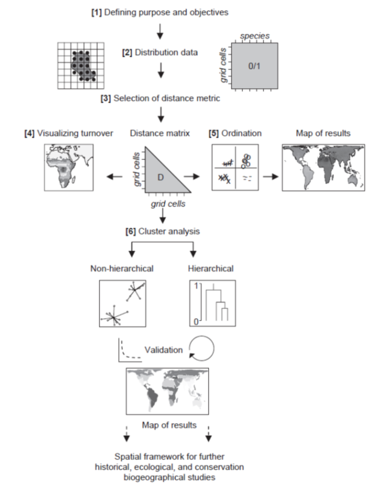
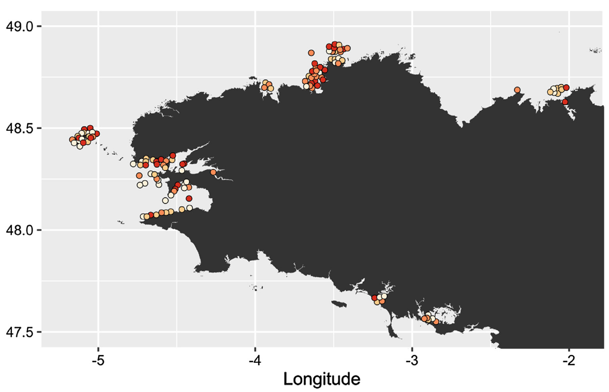

  
# Introduction
  
Nous allons ici suivre le cadre méthodologique de Kreft & Jetz 2010 (J. Biogeogr.) pour analyser la diversité beta et rechercher des ensembles biogéographiques. Le TP suit donc globalement ce cadre :




Vous allez ici travailler sur un jeu de données composé d'invertébrés benthiques échantillonnés sur différents secteurs sur le pourtour de la Bretagne. Votre but est de découvrir s'il y a des groupes de communautés identifiables, et, s'ils existent, essayer de comprendre qu'est-ce qui les explique : distribution géographique ou facteurs locaux ?



Ces données sont issues [d'un travail publié sur la conservation des communautés fixées des tombants rocheux de la Bretagne](https://www.sciencedirect.com/science/article/abs/pii/S1470160X17300602?via%3Dihub).

# Chargez les packages


Pour ce TP vous avez besoin de cinq packages : `betapart` (calcul de diversité beta), `recluster` (fonctions de clusterisation), `dendextend` (fonctions utiles pour la manipulation de dendrogrammes), `vegan` (NMDS) et `rnaturalearth` (fond de carte).

# 1. Chargement des données

Téléchargez les données:

- [Matrice de présence-absence](https://github.com/Farewe/Cours_Bioregionalisation/raw/master/data/invertebres_benthiques.RDS)

- [Localisation des sites](https://github.com/Farewe/Cours_Bioregionalisation/raw/master/data/sites_invertebresbenthiques.RDS)

Chargez la matrice de présence-absence et la localisation des sites en utilisant la commande `readRDS`.

Si vous le souhaitez, calculez la richesse spécifique et supprimez les sites à faible richesse spécifique de la base de données.


# 2. Calcul des distances entre bassins avec l’indice ßsim [3]

$$ \beta_{sim}= 1 - \frac{a}{min(b,c)+a}$$

où a = nombre d'espèces partagées entre les deux sites; b et c = nombre d'espèces uniques à chacun des deux sites

Fonction `beta.pair` dans le package betapart

# 3. Visualisation des distances entres sites

Faites une ordination NMDS pour représenter graphiquement les distances entre les sites, et affichez de la carte colorée des distances entre bassins.

Fonctions `metaMDS`, `recluster.col` et `recluster.plot.col` dans le package `recluster`


Pour faire la carte il faudra colorer les sites avec les bonnes couleurs. On va utiliser la même technique que dans le premier TP (le match !).

Il faudra ajouter tout le tableau issu de recluster.col (dans mon exemple ci-dessous je l’ai appelé col.subtidal) dans le tableau qui contient la localisation des sites, car les couleurs sont réparties sur plusieurs colonnes en tant que valeurs rouge, vert et bleu (colonnes 3, 4 et 5 – voir la section Value de l’aide de recluster).

Pour ne pas s’y perdre, attribuez des noms aux colonnes de `col.subtidal`, par exemple :
`colnames(col.subtidal) <- c("nmdsx", "nmdsy", "nmdsred", "nmdsgreen", "nmdsblue")`

Pour cela, le plus simple est d’utiliser la commande data.frame qui permettra d’ajouter plusieurs colonnes :
```{r eval=FALSE}
sites <- data.frame(sites, 
                    col.subtidal[match(             ,
                                       ), ])
```
Je vous laisse écrire le contenu de `match(    )`.

Ensuite, pour afficher la carte, il faudra spécifier les couleurs en indiquant les bonnes colonnes dans : 
```{r eval=FALSE}
plot(sites, col = rgb(red =   ,
                      green =   ,
                      blue =   ,
                      maxColorValue = 255))

# Ajoutez les contours (grossiers) de la Bretagne avec le package rnaturalearth
library(rnaturalearth)
wm <- ne_coastline(scale = 50, returnclass = "sp")

plot(wm, add = TRUE)
```

Qu'observez-vous sur la NMDS et sur la carte ? Comment est distribuée la diversité beta ? Semble-t-il y avoir un effet spatial ou pas ? Cet effet est-il le seul ? 


# 4. Faire la classification ascendante hiérarchique 

Réaliser une classification ascendante hiérarchique avec la méthode UPGMA [6]. Etant donné que l’ordre des sites influence la classification, il faut faire un arbre consensus en rééchantillonnant de nombreuses fois les noms des sites aléatoirement. 
Pour cela, il faut normalement utiliser la fonction `recluster.cons` du package `recluster`. Cependant, comme vous aurez l'occasion de le voir, cette fonction va créer un arbre consensus dont la corrélation cophénétique n'est pas forcément bonne et dont la topologie est très difficile à exploiter. J'ai donc créé une version alternative de la fonction `recluster.cons` qui calculera la distance cophénétique pour chaque sous-arbre et permettra de sélectionner l'arbre ou les arbres pour lesquels la corrélation cophénétique est maximale.

Pour charger la fonction modifiée, installez le package `devtools` puis utilisez :

```{r eval=FALSE}
devtools::source_url("https://raw.githubusercontent.com/Farewe/Cours_Bioregionalisation/master/scripts/modified_recluster_tree_function.R")
```

Cela charge la fonction appelée `modified.recluster.cons` en mémoire, et celle-ci fonctionne exactement comme `recluster.cons`. Utilisez donc `modified.recluster.cons` sur votre matrice de distance pour faire la classification ascendante hiérarchique.


# 5. Evaluer la qualité de la classification consensus

Pour cela, vous allez analyser la corrélation entre distance cophénétique et dissimilarité entre sites
Fonctions cophenetic et cor dans le package stats. Cette étape est plus compliquée qu’elle n’en a l’air, car il faut contrôler l’ordre des noms et gérer les différents formats de fichier.
Voici un script qui fonctionne :
```{r eval=FALSE}
# On récupère les distances cophénétiques de l'arbre consensus, on les met en format matrix
coph.subtidal <- as.matrix(cophenetic(as.hclust(tree.subtidal$cons)))

# On fait en sorte que l'ordre des sites soit identique entre la matrice de distance initiale (dist.subtidal$beta.sim) et la matrice de distance cophénétique grâce à la commande match
coph.subtidal <- coph.subtidal[match(attr(dist.subtidal$beta.sim, "Labels"), 
                                     rownames(coph.subtidal)),
                               match(attr(dist.subtidal$beta.sim, "Labels"), 
                                     colnames(coph.subtidal))]
# On transforme la "matrice de distance" (= format "dist") initiale en matrice (= format "matrix"), pour pouvoir calculer la corrélation sur deux objets identiques
dist.subtidal.matrix <- as.matrix(dist.subtidal$beta.sim)

# On calcule la corrélation entre les deux matrices, mais uniquement sur le triangle inférieur pour éviter de doubler artificiellement le nombre d'observations
cor(dist.subtidal.matrix[lower.tri(dist.subtidal.matrix)],
    coph.subtidal[lower.tri(coph.subtidal)])
```

Comparez la valeur de corrélation cophénétique de l'arbre consensus aux valeurs de corrélation cophénétiques de tous les arbres individuels. Que remarquez-vous ? 

Choisissez de continuer votre analyse soit sur l'arbre consensus, soit sur l'un des arbres individuels en utilisant votre analyse de la corrélation cophénétique. Stockez l'arbre retenu dans un objet appelé `chosen.tree` sur lequel vous effectuerez toutes les manipulations suivantes.

Affichez votre arbre avec `plot`

*Rappel* Pour extraire un élément d'une liste, on utilise les doubles crochets, par exemple `tree.subtidal$trees[[31]]`.


# 6. Rechercher la hauteur à laquelle couper l'arbre

Essayez la méthode de Holt et al. 2013, qui consiste à comparer la "dissimilarité expliquée par les clusters" (= somme des dissimilarités entre sites qui appartiennent à des clusters différents) à la dissimilarité totale (= somme des dissimilarités de la matrice de distance initiale). Par exemple, si vous choisissez de couper l'arbre pour avoir 2 clusters, dans ce cas la "dissimilarité expliquée par les clusters" consiste à faire la somme de la dissimilarité entre sites qui appartiennent à des clusters différents. Si deux sites appartiennent au même cluster, leur distance ne sera pas comptabilisée dans la somme de "dissimilarité expliquée par les clusters". 

Pour cela, utilisez la fonction `recluster.expl.diss` dans le package recluster en limitant le nombre maximum de clusters à 50.

Dans l'objet que vous obtiendrez, recherchez le nombre de clusters qui correspond à une dissimilarité totale expliquée d'au moins 90% (= seuil minimum de Holt et al. 2013). Vous pouvez aussi faire un graphique du % de dissimilarité expliquée en fonction du nombre de clusters.

Une fois que vous avez le nombre "optimal" de clusters au seuil de 90%, il peut être utile de savoir à quelle hauteur de coupe de l'arbre ce nombre correspond. Voici une boucle `while` qui permet de le faire : 

```{r eval=FALSE}
k <- 0
h <- 1
while(k < nclust) # en supposant que votre nombre de clusters est stocké dans "nclust"
{
  h <- h - .01
  clusters.subtidal <- cutree(chosen.tree, h = h) # chosen.tree est votre arbre
  k <- max(clusters.subtidal)
}
# Attention à remettre les noms dans l’ordre alphabétique pour l’étape 7 (car la NMDS a les noms dans l’ordre alphabétique)
clusters.subtidal <- clusters.subtidal[order(names(clusters.subtidal))]
```

# 7. Attribuer des couleurs aux clusters en utilisant les axes de la NMDS

Utilisez la fonction `recluster.group.col` dans le package `recluster`.	Stockez ces couleurs dans un objet nommé `groupcol.subtidal`.


# 8. Affichez la carte des sites groupés par clusters

Faites la carte des sites, en utilisant les couleurs de l'étape #7 pour illustrer les différents clusters.

```{r eval=FALSE}
# Attribution des clusters à la table des sites
sites$cluster[match(names(clusters.subtidal), sites$station_id)] <- clusters.subtidal
# Attribution des couleurs sur la base des axes de la nmds
sites[, c("nmdsx1", "nmdsy1", "r1", "g1", "b1")] <-  
  groupcol.subtidal[match(sites$station_id, rownames(groupcol.subtidal)), ]
```

Décrivez le résultat que vous obtenez : 

- Semble-t-il y avoir différents clusters ?

- Comment sont-ils distribués ? 

- Est-ce que les sites sont assemblés en clusters en suivant un patron spatial évident ? 

- Est-il possible que d'autres facteurs expliquent les clusters identifiés pour les sites ?
