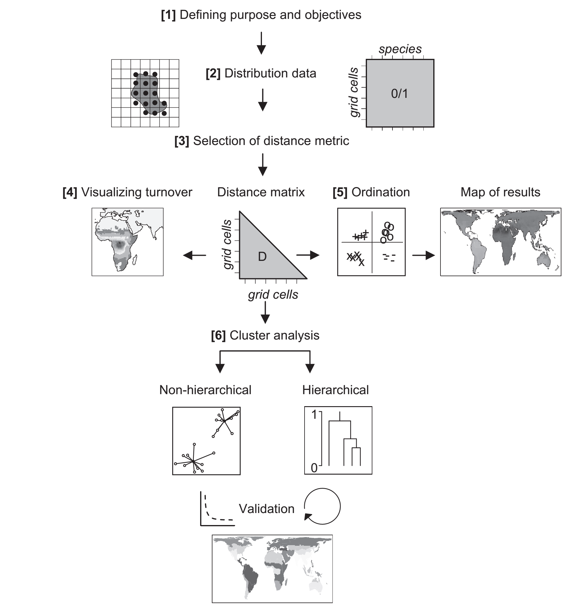

  
**ATTENTION** ce document n'est plus à jour

# Introduction
  
Nous allons ici suivre le cadre méthodologique de Kreft & Jetz 2010 (J. Biogeogr.) pour analyser la diversité beta et rechercher des ensembles biogéographiques. Le TP suit donc globalement ce cadre :




Vous allez ici travailler sur un jeu de données composé d'invertébrés benthiques échantillonnés sur différents secteurs sur le pourtour de la Bretagne. Votre but est de découvrir s'il y a des groupes de communautés identifiables, et, s'ils existent, essayer de comprendre qu'est-ce qui les explique : distribution géographique ou facteurs locaux ?


Ces données sont issues [d'un travail publié sur la conservation des communautés fixées des tombants rocheux de la Bretagne](https://www.sciencedirect.com/science/article/abs/pii/S1470160X17300602?via%3Dihub).

# Chargez les packages


Pour ce TP vous avez besoin de trois packages : `bioregion` (calcul de diversité beta et classification), `sf` (manipulation d'objets spatiaux) et `rnaturalearth` (fond de carte).

# 1. Chargement des données

Téléchargez les données:

- [Matrice de présence-absence](https://github.com/Farewe/Cours_Bioregionalisation/raw/master/data/invertebres_benthiques.RDS)

- [Localisation des sites](https://github.com/Farewe/Cours_Bioregionalisation/raw/master/data/sites_invertebresbenthiques.RDS)

Chargez la matrice de présence-absence et la localisation des sites en utilisant la commande `readRDS()`. 

Si vous le souhaitez, calculez la richesse spécifique et supprimez les sites à faible richesse spécifique de la base de données.


# 2. Calcul des distances entre bassins avec l'indice ßsim [3]

$$ \beta_{sim}= 1 - \frac{a}{min(b,c)+a}$$

où a = nombre d'espèces partagées entre les deux sites; b et c = nombre d'espèces uniques à chacun des deux sites

Fonction `dissimilarity()` du package `bioregion`

# 3. Visualisation des distances entres sites

Faites une ordination Non-Metric Dimensional Scaling (NMDS) pour représenter graphiquement les distances entre les sites.

Pour cela, il vous faudra procéder par étapes. Tout d'abord, transformer l'objet de distances de `bioregion` en matrice de distance avec le code suivant :

```{r eval = FALSE}
matrix.dist <- net_to_mat(dist.subtidal,
                          weight = TRUE, squared = TRUE, symmetrical = TRUE)
matrix.dist <- as.dist(matrix.dist)
```

Ensuite, calculer la NMDS sur cette matrice de distance avec la fonction `metaMDS` du package `vegan`, et affichez le graphique avec `plot()`.

Qu'observez-vous sur la NMDS ? Comment est distribuée la diversité beta ? Semble-t-il y avoir un effet spatial ou pas ? 


# 4. Faire la classification ascendante hiérarchique 

Réaliser une classification ascendante hiérarchique avec la méthode UPGMA [6]. Etant donné que l'ordre des sites influence la classification, il faut faire de nombreux arbres  rééchantillonnant de nombreuses fois les noms des sites aléatoirement, et sélectionner le meilleur arbre.  

Pour cela, utilisez la fonction `hclu_hierarclust()` du package `bioregion`, et sélectionnez les paramètres pour respecter les conditions ci-dessus. Pour le moment, contentez-vous de faire la classification ascendante hiérarchique (l'arbre), sans chercher à découper l'arbre pour avoir des clusters.

**Important :** Le package `bioregion` utilise maintenant par défaut l'algorithme IHCT (Iterative Hierarchical Consensus Tree), qui est une avancée majeure par rapport aux méthodes classiques. Voici pourquoi :

- **Le problème des arbres consensus classiques** : L'approche classique (type Dapporto) consistait à construire de nombreux arbres en randomisant l'ordre des sites, puis à calculer un arbre consensus. Cependant, cette méthode produisait souvent des arbres avec une topologie incohérente et un très faible coefficient de corrélation cophénétique, rendant les résultats difficiles à interpréter.

- **La solution IHCT** : L'algorithme IHCT reconstruit un arbre consensus de manière itérative en divisant progressivement l'ensemble des sites en deux sous-groupes à chaque étape, en se basant sur l'appartenance majoritaire des sites à travers tous les arbres randomisés. Cette approche garantit que chaque branche de l'arbre reflète la décision majoritaire parmi toutes les versions randomisées de la matrice de distance. Le résultat est un arbre consensus bien plus robuste et interprétable.

N'hésitez pas à comparer par vous-même les résultats entre l'ancienne méthode (paramètre `optimal_tree_method = "consensus"`) et la nouvelle méthode IHCT (`optimal_tree_method = "iterative_consensus_tree"`).

Affichez l'arbre avec `plot()`. Qu'est-ce que l'arbre nous dit des valeurs de dissimilarité ? Regardez les valeurs de dissimilarité sur l'arbre, et réfléchissez à ce qu'elles signifient. Quelles conséquences pour les groupes que l'on obtiendra ?

# 5. Evaluer la qualité de la classification consensus

Quelle est la valeur du coefficient cophénétique de votre arbre ? Que vous dit cette valeur ? Cette valeur indique à quel point l'arbre hiérarchique représente fidèlement les distances originales entre sites. Plus elle est proche de 1, meilleure est la représentation.


# 6. Rechercher la hauteur à laquelle couper l'arbre

Pour identifier une partition dite 'optimale' sur un arbre, il faut le découper de nombreuses fois (chaque découpe est appelée une partition), et analyser comment les partitions se comportent par rapport à des métriques d'évaluation. Par exemple, sur notre jeu de données, il y a 162 sites, donc on peut essayer de regarder toutes partitions possibles allant de 2 clusters à 161 clusters. Ensuite, on va calculer des métriques sur chaque partition, et identifier une ou plusieurs partitions optimales.

Pour cet exercice je vous propose d'utiliser la métrique de Holt et al. 2013, qui consiste à comparer la "dissimilarité expliquée par les clusters" (= somme des dissimilarités entre sites qui appartiennent à des clusters différents) à la dissimilarité totale (= somme des dissimilarités de la matrice de distance initiale). Par exemple, si vous choisissez de couper l'arbre pour avoir 2 clusters, dans ce cas la "dissimilarité expliquée par les clusters" consiste à faire la somme de la dissimilarité entre sites qui appartiennent à des clusters différents. Si deux sites appartiennent au même cluster, leur distance ne sera pas comptabilisée dans la somme de "dissimilarité expliquée par les clusters". 

La première étape consiste donc à découper l'arbre de nombreuses fois, par exemple essayer de le découper pour obtenir 2 clusters, 3 clusters, 4 clusters, etc. jusque 50 clusters. _Vous pouvez faire plus si vous le souhaitez, mais ça sera plus long à calculer, et en général on évite d'analyser des partitions avec trop de clusters car c'est beaucoup plus difficiles à interpréter pour nous humains aux capacités cognitives limitées ;)_

Pour découper l'arbre, utilisez la fonction `cut_tree()` et demandez de 2 à 50 clusters. Cela vous donnera un objet en sortie qui contient 49 partitions. Ensuite, calculez des métriques sur chaque partition avec la fonction `partition_metrics()`. Choisissez bien de calculer la métrique de Holt et al. 2013. Enfin, utilisez ensuite la fonction `find_optimal_n()` pour trouver la partition optimale en recherchant un nombre de clusters qui correspond à **trois seuils de dissimilarité expliquée : 40%, 50% et 60%**. *Note: seuil se traduit cutoff en anglais*

Pourquoi utiliser des seuils relativement bas (40-60%), alors que Holt et al. ont utilisé des seuils de 90 à 99.9% ? Parce qu'il s'agit ici d'une étude régionale avec peu de dissimilarité entre les sites, contrairement à Holt et al. qui ont réalisé une étude globale avec des sites très différents. Si vous utilisez un seuil à 90 ou plus, vous allez avoir un grand nombre de clusters très peu différents entre eux, ce qui sera très peu informatif.

Une fois que vous avez identifié les nombres de clusters optimaux pour ces trois seuils, choisissez celui qui vous semble le plus pertinent (par exemple le seuil à 50%), et recoupez l'arbre avec ce nombre de clusters optimal.

**Astuce** : Vous pouvez afficher la hiérarchie des clusters obtenue dans la console en utilisant la fonction générique `summary()` sur votre objet de découpage d'arbre. Cette fonction vous donnera un aperçu clair de la structure hiérarchique de vos clusters.

Quels sont les nombres de clusters aux seuils de 40%, 50% et 60% de dissimilarité expliquée ?
A quelles hauteurs l'arbre a-t-il été coupé ?


# 7. Faire la carte des clusters obtenus

Le package `bioregion` fournit maintenant des fonctions dédiées pour créer facilement des cartes de biorégions avec des couleurs automatiques.

Tout d'abord, transformez le tableau de localisation des sites en objet spatial de type `sf` avec la commande `st_as_sf()`, en spécifiant bien quelles sont les colonnes contenant les coordonnées avec l'argument `coords`. Indiquez aussi quel est le système de coordonnées : `crs = "EPSG:4326"` (EPSG:4326 est le petit code international pour le système de coordonnées WGS84).

Ensuite, attribuez automatiquement des couleurs à vos clusters avec la fonction `bioregion_colors()` :

```{r eval = FALSE}
# Ajouter des couleurs aux clusters
hclust_colored <- bioregion_colors(hclust_subtidal, 
                                   palette = "Vivid",
                                   cluster_ordering = "n_sites")
```

Cette fonction attribue intelligemment des couleurs vives aux clusters les plus importants (selon le nombre de sites), et des nuances de gris aux clusters moins importants.

Enfin, créez la carte avec la fonction `map_bioregions()` :

```{r eval = FALSE}
map_bioregions(hclust_colored, sites)
```

Voilà ! En deux lignes de code vous obtenez une carte avec des couleurs cohérentes et automatiques.

Si vous souhaitez personnaliser la carte, vous pouvez ajouter un fond avec le package `rnaturalearth`. Par exemple :

```{r eval = FALSE}
library(rnaturalearth)
wm <- ne_coastline(scale = 50, returnclass = "sf")

# Carte des biorégions
map_bioregions(hclust_colored, sites)

# Ajouter le trait de côte
plot(wm, add = TRUE)
```


Décrivez le résultat que vous obtenez : 

- Semble-t-il y avoir différents clusters ?

- Comment sont-ils distribués ? 

- Est-ce que les sites sont assemblés en clusters en suivant un patron spatial évident ? 

- Est-il possible que d'autres facteurs expliquent les clusters identifiés pour les sites ?

- Quelles difficultés éprouvez-vous à l'interprétation ? Comment faudrait-il y remédier ?


# 8. Si vous avez fini en avance : explorez les autres méthodes de clustering non hiérarchique !

[Vous pouvez accéder au site qui détaille les différentes fonctions du package ici](https://biorgeo.github.io/bioregion)
