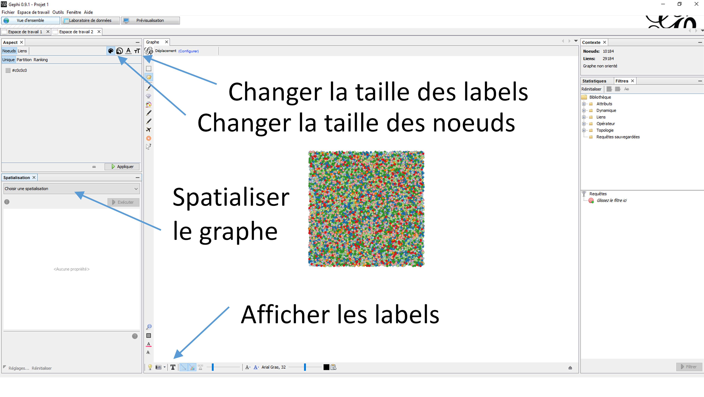

# 1. Chargement des données (bases poissons et polygones spatialisés des bassins)

```{r}
# Packages
library(biogeonetworks)
library(rgdal)
library(plyr)
library(RColorBrewer)

# Répertoire de travail
setwd("c:/r/projets/Cours_Bioregionalisation/")

# Shapefiles
basins <- readOGR("./data/data_cours/basin2013_simplif.shp")

# Occurrence databases
load("./data/data_cours/fishdb1.RData")
load("./data/data_cours/fishdb2.RData")
```


# 2. Créer le réseau biogéographique


```{r}
writePajek(fishdb1, 
           site.field = "Basin",
           species.field = "Species",
           filename = "./data/fishdb1.net")
```


# 3. Appliquer l'algorithme de clusterisation

```{r}
system("./infomap --undirected --tree --map ./data/fishdb1.net ./data/")
```


# 4. Lire l'arbre et les clusters créés par Map Equation sous R

```{r}
fish.net1 <- readInfomapTree("./data/fishdb1.tree")
```

La fonction nous informe que le réseau a une hiérarchie de 5 niveaux, avec 15 clusters identifiés au niveau 1.


# 5. Analyser séparément les sites et les espèces

```{r}
fish.sites1 <- getSiteTable(fishdb1, site.field = "Basin", network = fish.net1)
fish.species1 <- getSpeciesTable(fishdb1, species.field = "Species", network = fish.net1)

head(fish.sites1)
count(fish.sites1$lvl1)
count(fish.species1$lvl1)
```

On observe les 15 clusters du niveau 1 sont hétérogènes. Certains clusters contiennentt beaucoup de bassins et sont très riches, tandis que d'autres ont peu de bassins et sont peu riches. S'agissant d'étudier les grandes régions biogéographiques, nous allons limiter notre analyse aux clusters qui ont beaucoup de bassins et beaucoup d'espèces. Les 6 premiers clusters ont plus de 50 bassins versants et plus de 200 espèces, donc nous travaillerons avec ces 6 clusters ici, mais vous pouvez choisir un chiffre différent (et vos résultats peuvent différer - MapEquation fonctionne sur un processus aléatoire donc il faut faire des répétitions, [cf. tutorial en ligne](https://github.com/Farewe/biogeonetworks)).

# 6. Attribuer des couleurs aux grandes régions

Attribuez des couleurs en vous limitant au nombre identifié à l’étape 5. 

Fonction `attributeColors`, en précisant le nombre maximum de régions avec l’argument `nb.max.colors` et la base de données avec `db`. Lancez cette commande une première fois sur le réseau (issu de `readInfomapTree`), puis une seconde fois sur la table des bassins (issue de `getSiteTable`). Cela permettra d’avoir les bonnes couleurs à la fois sur le réseau complet (pour l’étape 8) et sur les bassins (pour la carte étape 7).

# 7. Affichez la carte des bassins avec les couleurs des régions

Pour cela, il faudra ajouter une colonne contenant les couleurs au data.frame de l’objet spatial. Attention !! Les couleurs doivent être dans le bon ordre !! Pour cela il faut faire la correspondance entre les noms des bassins dans l’objet spatial et les noms dans la table des bassins, avec la commande `match`.


Ci-dessous un exemple de code, où on veut associer la colonne "Color" de tableau1 dans tableau2, tout en s'assurant que l'on ne mélange pas les sites (colonne Name).

**tableau1**

| Name          | Color         | 
| ------------- |:-------------:| 
| 1             | Red           | 
| 2             | Green         |
| 3             | Blue          |
| 4             | Green         |


**tableau2**

| Name          | Richness      | 
| ------------- |:-------------:| 
| 2             | 31            | 
| 1             | 42            |
| 4             | 35            |
| 3             | 21            |


```{r eval=FALSE}
tableau2$Color <- tableau1$Color[match(tableau2$Basin, tableau1$Name)]
```


**tableau2**

| Name          | Richness      | Color    |
| ------------- |:-------------:|:--------:|
| 2             | 31            | Green    |
| 1             | 42            | Red      |
| 4             | 35            | Green    |
| 3             | 21            | Blue     |

Une fois que vous avez ajouté les couleurs dans la table attributaire des bassins, faites la carte, sans oublier de préciser l'argument `col` de la fonction `plot` pour avoir les couleurs.


# 8. Ecrire le réseau biogéographique pour Gephi


Ecrivez le réseau biogéographique avec les clusters et couleurs sur le disque dur dans un format lisible par Gephi (format .gdf). 

Fonction `writeGDF`. Nécessite la base de données et le réseau. Précisez les noms des colonnes des colonnes correspondant aux sites et aux espèces dans la base de données. Précisez le nom de la colonne correspond à la couleur dans votre réseau. Donnez le nom de fichier sous lequel sera enregistré votre réseau (extension .gdf).


# 9. Analysez le réseau biogéographique sous gephi

Analysez le réseau avec le fichier écrit à l’étape 8. Spatialisez votre réseau avec l’algorithme force atlas 2. Ajustez la taille de vos noeuds selon leur « degré » (*Aspect* > *Noeuds* > *Ranking* > liste déroulante : *degré* - essayer différentes gammes de valeurs). Affichez les noms des noeuds et ajuster la taille des noms selon la même méthode. Exportez votre graphe dans la fenêtre « *Prévisualisation* » en jouant avec les options.




# 10. Refaites l'analyse pour la seconde base de données

Répétez les étapes 2-9 pour la base de données fishdb2 et comparez les graphes et les cartes.

**Qu'est-ce qui peut expliquer la différence entre les deux bases de données ?**

# 11. (facultatif) Calculez le coefficient de participation.

Utilisez la fonction `partic.coef`.

```{r eval=FALSE}
objet.sortie <- partic.coef(<arbre map equation>, 
                         db = fishdb1, site.field = "Basin",
                         species.field = "Species",
                         cluster.field = "lvl1")
```


Ajoutez le coefficient de participation à votre table attributaire des bassins, et visualisez le coefficient de participation.

# 12. (facultatif) Faites une belle carte :) 

Essayez de changer la projection, d'ajouter un graticule...
