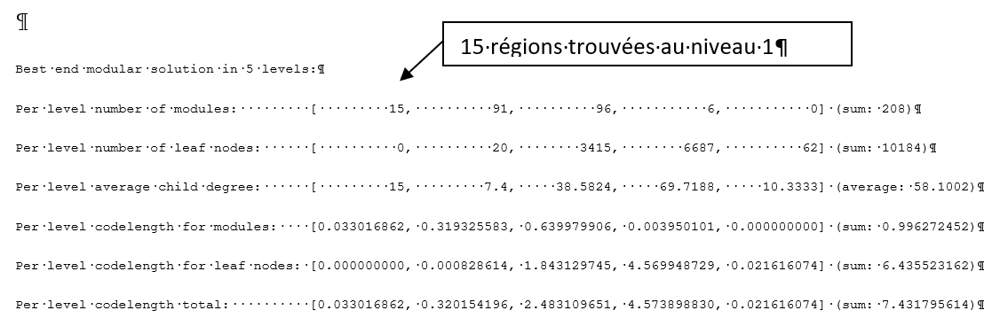

# Introduction

Vous avez à votre disposition deux bases de données sur la distribution des poissons d’eau douce par bassin versant (fishdb1 et fishdb2), à l’échelle du monde entier. Votre but est de déterminer les régions biogéographiques de poissons d’eau douce à l’échelle globale pour ces deux bases de données, de les comparer. Sur la base de cette comparaison, trouvez ce qui différencie ces deux bases de données.
Ici, vous appliquerez la première des deux approches vues en cours : les réseaux biogéographiques. Pour cette approche, vous comparerez les réseaux et les cartes entre les deux bases.

# Pré-requis : 

## Installer et charger le package `biogeonetworks`

Il n'existe pas de package R permettant d'analyser facilement les réseaux biogéographiques aujourd'hui, donc j'en ai développé un pour vous faciliter la tâche. Il s'agit du package `biogeonetworks`. Ce package fournit plusieurs fonctions pour lire, écrire et manipuler les réseaux biogéographiques. Il est fait pour interagir avec le logiciel de visualisation Gephi et l'algorithme de clusterisation Map Equation. 

Je n'ai pas publié le package sur le CRAN, donc pour l'installer vous devez le faire depuis le répertoire de développement GitHub avec les commandes suivantes :

```{r eval = FALSE}
install.packages("devtools")
devtools::install_github("Farewe/biogeonetworks")
```

[Il existe un tutorial pour apprendre `biogeonetworks` en profondeur ici](https://github.com/Farewe/biogeonetworks), mais pour ce TP vous n'en avez pas besoin.

## Récupérer l'algorithme map equation

Allez sur le [github de map equation](https://github.com/mapequation/infomap/releases) pour récupérer l'algorithme. Prenez bien l'algorithme qui correspond à votre système d'exploitation. Prenez les versions de base, pas les versions "noomp" (= sans Open MP, une librairie de parallélisation - n'essayez les verisions noomp que si la version de base ne fonctionne pas).

Mettez l'exécutable dans votre répertoire de travail. 


# 1. Chargement des données (bases poissons et polygones spatialisés des bassins)

[Téléchargez les données ici](https://github.com/Farewe/Cours_Bioregionalisation/raw/gh-pages/data/data_cours/data_cours.zip)

Utilisez les fonctions `load` (base R) et `st_read` (package sf)


# 2. Créer le réseau biogéographique

Créez le réseau biogéographique à partir de `fishdb1` écrivez le sur le disque dur dans un format lisible (format PAJEK) par map equation.

Utilisez la fonction writePajek : fournir la base de données, et les noms des colonnes correspondant aux espèces et aux sites, et le nom du fichier pajek (extension .net). Taper ?writePajek pour connaître les arguments. 

# 3. Appliquer l'algorithme de clusterisation

Rechercher les régions avec Map Equation, que vous voulez les résultats sous forme d’arbre (`--tree`) et que vous voulez qu'il tourne 10 fois pour trouver la solution optimal (`-N 10`.  Map Equation se lance en ligne de commande ; il est possible de le lancer depuis R avec la fonction `system()`. Si vous voulez connaître tous les arguments possibles de map equation, allez jeter un oeil [à leur site web](https://www.mapequation.org/infomap/#Parameters)


```{r eval=FALSE}
# Structure de la commande :
# <chemin vers infomap>       <chemin vers le fichier du réseau biogéographique>     <chemin vers le dossier de sortie>     <arguments d'infomap> 
# exemple :
# "c:/r/infomap                 c:/r/data/fishdb1.net                                   c:/r/data"                          --tree -N 10

system("./infomap ./data/fishdb1.net ./data/ --tree -N 10")

```



(Exemple de résultat, vous aurez certainement un résultat différent avec moins de régions)

# 4. Lire l'arbre et les clusters créés par Map Equation sous R

Fonction `readInfomapTree`


# 5. Analyser séparément les sites et les espèces

Récupérez les tableaux indiquant quel bassin est associé à quelle région, et quelle espèce est associée à quelle région. Inspectez ces tableaux, et regardez le nombre de bassins / espèces dans chaque grande région (niveau 1, « lvl1 »). Déduisez-en le nombre de régions à garder.

Fonction `getSiteTable` et `getSpeciesTable`. Ces deux fonctions nécessitent à la fois la base `fishdb1` et l’arbre créé par Map equation. N’oubliez pas de préciser les noms de colonnes correspondant aux espèces ou aux bassins. 

Pour inspecter le nombre de bassins ou d’espèces par niveau utilisez la fonction `count` du package `plyr` (permet de compter le nombre de répétitions d’un facteur).

# 6. Attribuer des couleurs aux grandes régions

Attribuez des couleurs en vous limitant au nombre identifié à l’étape 5. 

Fonction `attributeColors`, en précisant le nombre maximum de régions avec l’argument `nb.max.colors` et la base de données avec `db`. Lancez cette commande une première fois sur le réseau (issu de `readInfomapTree`), puis une seconde fois sur la table des bassins (issue de `getSiteTable`). Cela permettra d’avoir les bonnes couleurs à la fois sur le réseau complet (pour l’étape 8) et sur les bassins (pour la carte étape 7).

# 7. Affichez la carte des bassins avec les couleurs des régions

Pour cela, il faudra ajouter une colonne contenant les couleurs au data.frame de l’objet spatial. Attention !! Les couleurs doivent être dans le bon ordre !! Pour cela il faut faire la correspondance entre les noms des bassins dans l’objet spatial et les noms dans la table des bassins, avec la commande `match`.


Ci-dessous un exemple de code, où on veut associer la colonne "Color" de tableau1 dans tableau2, tout en s'assurant que l'on ne mélange pas les sites (colonne Name).

**tableau1**

| Name          | Color         | 
| ------------- |:-------------:| 
| 1             | Red           | 
| 2             | Green         |
| 3             | Blue          |
| 4             | Green         |


**tableau2**

| Name          | Richness      | 
| ------------- |:-------------:| 
| 2             | 31            | 
| 1             | 42            |
| 4             | 35            |
| 3             | 21            |


```{r eval=FALSE}
tableau2$Color <- tableau1$Color[match(tableau2$BasinName, tableau1$Name)]
```


**tableau2**

| Name          | Richness      | Color    |
| ------------- |:-------------:|:--------:|
| 2             | 31            | Green    |
| 1             | 42            | Red      |
| 4             | 35            | Green    |
| 3             | 21            | Blue     |

Une fois que vous avez ajouté les couleurs dans la table attributaire des bassins, faites la carte, sans oublier de préciser l'argument `col` de la fonction `plot` pour avoir les couleurs.


# 8. Ecrire le réseau biogéographique pour Gephi


Ecrivez le réseau biogéographique avec les clusters et couleurs sur le disque dur dans un format lisible par Gephi (format .gdf). 

Fonction `writeGDF`. Nécessite la base de données et le réseau. Précisez les noms des colonnes des colonnes correspondant aux sites et aux espèces dans la base de données. Précisez le nom de la colonne correspond à la couleur dans votre réseau. Donnez le nom de fichier sous lequel sera enregistré votre réseau (extension .gdf).


# 9. Analysez le réseau biogéographique sous gephi

Analysez le réseau avec le fichier écrit à l’étape 8. Spatialisez votre réseau avec l’algorithme force atlas 2. Ajustez la taille de vos noeuds selon leur « degré » (*Aspect* > *Noeuds* > *Ranking* > liste déroulante : *degré* - essayer différentes gammes de valeurs). Affichez les noms des noeuds et ajuster la taille des noms selon la même méthode. Exportez votre graphe dans la fenêtre « *Prévisualisation* » en jouant avec les options.


# 10. Refaites l'analyse pour la seconde base de données

Répétez les étapes 2-9 pour la base de données fishdb2 et comparez les graphes et les cartes.

**Qu'est-ce qui peut expliquer la différence entre les deux bases de données ?**

# 11. (facultatif) Faites une belle carte :) 

Essayez de changer la projection, d'ajouter un graticule...
